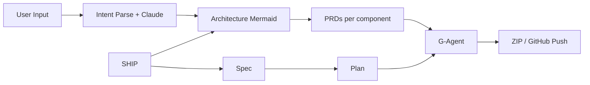

# G-Rump - Complete System Overview

> **Version:** 2.1.0 | **Last Updated:** January 2026

## What is G-Rump?

**G-Rump is Architecture-as-Code: Terraform for application architecture.** Your diagram and spec are the source of truth; code generation is optional. Living documentation that can generate code—not an AI code generator.

Built as a desktop app (Electron 28 + Svelte 5) with Node.js/Express 5 backend (plus an optional Rust Intent Compiler), G-Rump uses NVIDIA NIM (Kimi K2.5), OpenRouter, Groq, Together AI, and Ollama to automate intent understanding, architecture diagrams, spec (PRD) generation, and optional multi-agent code generation.

**Use G-Rump from:** Desktop (Windows/Linux), Web, VS Code Extension, CLI (`@g-rump/cli`), Docker, or chat bots (Telegram, Discord, WhatsApp/SMS via Twilio).

---

## Key Value Propositions

| Feature | Benefit |
|:-------:|:-------:|
| **18x Faster Builds** | SWC compiler (45s → 2.5s) |
| **60-70% Cost Savings** | Intelligent LLM routing & caching |
| **GPU Acceleration** | NVIDIA NIM integration |
| **Enterprise Security** | Built-in guardrails & monitoring |
| **Multi-Platform** | Windows, macOS, Linux, Docker, Web |
| **G-Agent System** | Autonomous AI agent for code generation |
| **RAG Integration** | Document-aware AI with hybrid search |

---

## Two Primary Modes

### 1. Architecture Mode (Design-First)
Describe → Architecture (Mermaid) → Spec (PRD) → (optional) Code. Phased workflow or full SHIP run. Lead with the diagram; code is optional.

### 2. Code Mode (Generate Code)
AI-powered chat with tools (bash, file read/write/edit, list_dir, git). Workspace-aware, plan mode, specialist agents, save/load sessions.

---

## Three Flows to Production

| Flow | When to Use | Path |
|------|-------------|------|
| **Chat-first** | Free-form exploration; architecture and diagrams appear in the chat thread | User describes intent in Architecture mode → architecture in chat → (optional) move to phase bar for Spec → (optional) Code |
| **Phase bar** | You have (or will generate) architecture and want explicit Spec → Code steps | Architecture → Spec → Code via WorkflowPhaseBar and workflowStore |
| **SHIP** | Fully automated pipeline: design → spec → plan → code in one run, no chat | Single run design→spec→plan→code → outcome in ShipMode |

---

## Architecture Overview

```
┌─────────────────────────────────────────────────────────────────────────────┐
│                    G-RUMP PLATFORM ARCHITECTURE                              │
├─────────────────────────────────────────────────────────────────────────────┤
│                                                                              │
│  ┌────────────────────────────────────────────────────────────────────────┐ │
│  │                         CLIENTS                                        │ │
│  │  Desktop (Electron)  │  Web App  │  VS Code  │  CLI  │  Bots  │ Docker │ │
│  └────────────────────────────────────────────────────────────────────────┘ │
│                                     │                                        │
│                                     ▼                                        │
│  ┌────────────────────────────────────────────────────────────────────────┐ │
│  │                 SVELTE 5 FRONTEND (5173)                               │ │
│  │  Chat Interface │ Diagram Renderer │ Workflow Phase Bar │ Tool Cards   │ │
│  └────────────────────────────────────────────────────────────────────────┘ │
│                                     │                                        │
│                                     ▼                                        │
│  ┌────────────────────────────────────────────────────────────────────────┐ │
│  │                 EXPRESS 5 BACKEND (3000)                               │ │
│  │  /api/chat │ /api/ship │ /api/codegen │ /api/architecture │ /api/prd  │ │
  │  │  G-Agent Orchestrator │ LLM Gateway │ Tool Execution │ Job Queue        │ │
│  └────────────────────────────────────────────────────────────────────────┘ │
│              │                    │                    │                     │
│              ▼                    ▼                    ▼                     │
│  ┌──────────────────┐  ┌──────────────────┐  ┌──────────────────────────┐  │
│  │ Rust Intent      │  │ LLM Providers    │  │ Data Layer               │  │
│  │ Compiler         │  │ ─────────────    │  │ ─────────                │  │
│  │ (CLI + WASM)     │  │ NVIDIA NIM       │  │ SQLite/PostgreSQL        │  │
│  │                  │  │ Kimi K2.5        │  │ Redis (cache/queue)      │  │
│  │                  │  │ OpenRouter       │  │ Supabase (auth)          │  │
│  │                  │  │ Groq, Together   │  │ Stripe (billing)         │  │
│  │                  │  │ Ollama (local)   │  │ Pinecone (RAG)           │  │
│  └──────────────────┘  └──────────────────┘  └──────────────────────────┘  │
└─────────────────────────────────────────────────────────────────────────────┘
```

### Mermaid Architecture

```mermaid
graph TB
    subgraph Clients
        CLI[CLI Tool]
        Desktop[Desktop App]
        Web[Web App]
        VSCode[VS Code Extension]
        Docker[Docker]
        Bots[Telegram/Discord/SMS]
    end
    
    subgraph API
        Ship[/ship]
        Chat[/chat]
        Codegen[/codegen]
         G-Agent[/g-agent]
        RAG[/rag]
        MCP[MCP Server]
    end
    
    subgraph Core
        Compiler[SWC/Rust Compiler]
        Cache[3-Tier Cache]
        Router[Smart Router]
        RAGEngine[RAG Engine]
        Memory[Memory System]
    end
    
    subgraph Providers
        NIM[NVIDIA NIM]
        Kimi[Kimi K2.5]
        OpenRouter[OpenRouter]
        Groq[Groq]
        Together[Together AI]
        Ollama[Ollama]
    end
    
    Clients --> API
    API --> Core
    Router --> Providers
```

---

## Tech Stack

| Layer | Technologies |
|:-----:|:------------:|
| **Desktop** | Electron 28, Svelte 5, Vite 5, TailwindCSS 3.4 |
| **Frontend** | TypeScript 5.3, Mermaid.js, Shiki, Lucide Icons |
| **Backend** | Node.js 20+, Express 5, TypeScript, SWC, Pino |
| **Compiler** | Rust 1.77+, rayon, SIMD (AVX2/AVX-512), WASM |
| **AI/ML** | NVIDIA NIM, Kimi K2.5, OpenRouter, Groq, Together AI, Ollama |
| **Database** | SQLite/better-sqlite3 (dev), Supabase/PostgreSQL (prod) |
| **Queue** | BullMQ, Redis, ioredis |
| **Vector DB** | Pinecone (RAG) |
| **Infrastructure** | Docker, Kubernetes, Vercel |
| **Monitoring** | Prometheus, OpenTelemetry, Grafana, Pino |
| **Testing** | Vitest, Playwright, k6 |
| **Payments** | Stripe |

---

## Monorepo Structure

```
grump/
├── frontend/                 # Svelte 5 + Vite (Electron desktop)
│   ├── src/
│   │   ├── components/       # UI components
│   │   ├── stores/           # Svelte stores
│   │   ├── lib/              # API client, utilities
│   │   └── App.svelte        # Root component
│   └── electron/             # Electron main process
├── backend/                  # Express 5 API (grump-backend)
│   ├── src/
│   │   ├── routes/           # API endpoints
│   │   ├── services/         # Business logic
│   │   ├── middleware/       # Auth, rate limit, validation
│   │   ├── features/         # Feature modules
│   │   ├── tools/            # LLM tool definitions
│   │   ├── prompts/          # System prompts
│   │   ├── skills/           # Extensible skills
│   │   └── mcp/              # MCP server
│   └── tests/
│       └── evals/            # G-Agent evaluation suite
├── packages/
│   ├── ai-core/              # Model router and registry
│   ├── cli/                  # CLI commands (@g-rump/cli)
│   ├── shared-types/         # Shared TypeScript types
│   ├── rag/                  # RAG engine
│   ├── voice/                # Voice ASR/TTS (NVIDIA Build)
│   ├── memory/               # Conversation memory
│   ├── kimi/                 # Kimi K2.5 optimizations
│   ├── compiler-enhanced/    # Incremental compilation
│   └── vscode-extension/     # VS Code extension
├── app-dashboard/            # Product dashboard (app.g-rump.com)
├── docs-site/                # User-facing docs (VitePress)
├── intent-compiler/          # Rust Intent Compiler
├── observability/            # Prometheus, Grafana, dashboards
├── infrastructure/           # Terraform, CloudFormation
├── deploy/                   # Docker Compose, Kubernetes
├── integrations/             # Third-party integrations
├── scripts/                  # Build, verify, benchmark
├── templates/                # Demo project templates
└── docs/                     # Developer documentation
```

---

## G-Agent System

G-Rump features **G-Agent**, an autonomous AI agent that handles code generation:

### 1. G-Agent Codegen Pipeline
PRD + architecture → G-Agent code generation:

| Capability | Description |
|------------|-------------|
| **Architecture** | Validates PRD, creates generation plan, defines dependencies |
| **Frontend** | Generates Vue/React components, routing, state management |
| **Backend** | Generates API endpoints, database models, business logic |
| **DevOps** | Creates Dockerfiles, CI/CD workflows, deployment configs |
| **Testing** | Generates unit, integration, and E2E tests |
| **Documentation** | Creates README, API docs, setup guides |
| **Security** | Security scanning and compliance |
| **Internationalization** | i18n support |

### 2. G-Agent Quality Assurance
- **Quality Analysis**: G-Agent analyzes work reports and identifies issues
- **Auto-Fix Engine**: Automatically applies fixes for auto-fixable issues
- **Work Reports**: G-Agent generates detailed work reports

---

## Core Workflow



1. **User Input** – Natural language intent + optional constraints
2. **AI Intent Understanding** – Rust Intent Compiler + Claude extract features, users, data flows, tech stack
3. **Mermaid Diagram** – Auto-create architecture (components, data flow, frontend/backend/DB)
4. **User Confirmation** – Interactive review/edit of diagram + summary
5. **PRD Generation** – One PRD per major system/component
6. **G-Agent Orchestration** – G-Agent builds incrementally using specialized capabilities
7. **Quality Assurance** – WRunner analysis and auto-fixes
8. **Iteration & Completion** – Auto test, code download (ZIP), GitHub create + push

---

## Session Model

| Concept | Location | Description |
|---------|----------|-------------|
| **Chat session** | Frontend (`sessionsStore`, localStorage) | One thread of messages; no backend persistence |
| **Ship session** | Backend DB (`ship_sessions`) | One run of Design→Spec→Plan→Code |
| **Codegen session** | Backend DB (`sessions`) | One code-generation job |

---

## API Domains

### Core Endpoints

| Domain | Key Endpoints |
|--------|---------------|
| **Health** | `/health`, `/health/quick`, `/health/ready`, `/health/detailed` |
| **Chat** | `POST /api/chat/stream` (SSE streaming) |
| **Ship** | `POST /api/ship/start`, `POST /api/ship/:id/execute`, `GET /api/ship/:id` |
| **Codegen** | `POST /api/codegen/start`, `GET /api/codegen/status/:id`, `GET /api/codegen/download/:id` |
| **Architecture** | `POST /api/architecture/generate`, `POST /api/architecture/generate-stream` |
| **PRD** | `POST /api/prd/generate`, `POST /api/prd/generate-stream` |
| **Plan** | `POST /api/plan/generate`, `POST /api/plan/:id/execute` |
| **Spec** | `POST /api/spec/start`, `POST /api/spec/:id/generate` |
| **Intent** | `POST /api/intent/parse` |
| **G-Agent** | `POST /api/g-agent/run`, `POST /api/g-agent/schedule` |
| **RAG** | `POST /api/rag/query`, `POST /api/rag/index`, `GET /api/rag/documents` |
| **Webhooks** | `POST /api/webhooks/trigger`, `POST /api/webhooks/outbound` |
| **Events** | `GET /api/events/stream` (SSE) |
| **Security** | `/api/security/scan`, `/api/security/sbom`, `/api/security/compliance` |
| **Auth** | `/auth/signup`, `/auth/login`, `/auth/logout`, `/auth/me` |
| **Billing** | `/api/billing/me`, `/api/billing/checkout`, `/api/billing/webhook` |

---

## LLM Providers

| Provider | Use Case | Configuration |
|----------|----------|---------------|
| **NVIDIA NIM** | Primary, GPU-accelerated | `NVIDIA_NIM_API_KEY` |
| **Kimi K2.5** | Cost-optimized, large context | Via NIM |
| **OpenRouter** | Multi-model fallback | `OPENROUTER_API_KEY` |
| **Groq** | Fast inference | `GROQ_API_KEY` |
| **Together AI** | Open models | `TOGETHER_API_KEY` |
| **Ollama** | Local/offline | `OLLAMA_URL` |
| **Anthropic** | Claude direct | `ANTHROPIC_API_KEY` |

### Cost Optimization
- **Intelligent Caching**: L1 LRU / L2 Redis / L3 Disk (50%+ hit rate)
- **Smart Model Routing**: Automatic LLM selection via `@grump/ai-core`
- **Parallel Processing**: SIMD optimizations in Rust compiler

---

## Chat Tools

First-class tools available in Code mode for every request:

| Tool | Description |
|------|-------------|
| `bash_execute` | Execute shell commands |
| `terminal_execute` | Terminal operations |
| `file_read` | Read file contents |
| `file_write` | Write file contents |
| `file_edit` | Edit existing files |
| `list_directory` | List directory contents |
| `codebase_search` | Search codebase |
| `git_status` | Git status |
| `git_diff` | Git diff |
| `git_log` | Git log |
| `git_commit` | Create commits |
| `git_branch` | Branch operations |
| `git_push` | Push (when enabled) |

All tools run workspace-scoped with path policy from `pathPolicyService`.

---

## Native Integrations

### Messaging Platforms
| Platform | Endpoint | Configuration |
|----------|----------|---------------|
| **Telegram** | `POST /api/messaging/telegram` | `TELEGRAM_BOT_TOKEN` |
| **Discord** | Gateway (bot) | `DISCORD_BOT_TOKEN` |
| **Twilio SMS/Voice** | `POST /api/messaging/inbound` | `TWILIO_*` vars |
| **WhatsApp** | Via Twilio | `TWILIO_WHATSAPP_NUMBER` |

### IDE Integrations
- **VS Code Extension**: Chat, SHIP workflow, code intelligence
- **Cursor**: REST API and MCP server integration
- **Claude Code**: MCP server tools

### MCP Server
G-Rump can run as an MCP server for Cursor/Claude Code:
```bash
GRUMP_API_URL=http://localhost:3000 npm run mcp-server
```
Tools: `grump_ship_start`, `grump_ship_execute`, `grump_architecture_generate`, `grump_intent_parse`, `grump_codegen_download`

---

## Quick Start

### Desktop (Recommended)
```bash
# Clone and install
git clone https://github.com/Aphrodine-wq/G-rump.com.git
cd G-rump.com && npm install

# Build shared packages (required)
npm run build:packages

# Configure API key
cp backend/.env.example backend/.env
# Add NVIDIA_NIM_API_KEY or OPENROUTER_API_KEY

# Run
.\start-desktop.bat  # Windows
# Or: npm run dev
```

### CLI
```bash
npm install -g @g-rump/cli
grump ship "Create a React component library"
```

### Docker
```bash
docker run -it grump/cli:latest ship "Build a REST API with authentication"
```

### Web
Visit [app.g-rump.com](https://app.g-rump.com)

---

## Development

```bash
# Run all checks
npm run check-all

# Run tests
npm test

# Run E2E tests
cd frontend && npm run test:e2e

# Run G-Agent evals
cd backend
export NVIDIA_NIM_API_KEY=your_key
npm run evals
```

- Golden tasks in `backend/tests/evals/*Tasks.ts`
- LLM-as-judge via `backend/tests/evals/judge.ts`
- Results in `frontend/test-results/agent-evals.json`
- CI runs evals on PRs and main

---

## Documentation Index

| Document | Description |
|----------|-------------|
| [GETTING_STARTED.md](GETTING_STARTED.md) | Quick start guide |
| [HOW_IT_WORKS.md](HOW_IT_WORKS.md) | Request pipeline and flows |
| [ARCHITECTURE.md](ARCHITECTURE.md) | System design |
| [AGENT_SYSTEM.md](AGENT_SYSTEM.md) | G-Agent orchestration |
| [API.md](API.md) | Complete API reference |
| [CAPABILITIES.md](CAPABILITIES.md) | Full feature list |
| [CODEBASE.md](CODEBASE.md) | Codebase map |
| [PRODUCTION_CHECKLIST.md](PRODUCTION_CHECKLIST.md) | Deployment guide |
| [SECURITY_BASELINE.md](SECURITY_BASELINE.md) | Security requirements |
| [TESTING.md](TESTING.md) | Testing strategy |
| [ROADMAP.md](ROADMAP.md) | Future plans |
| [RUNBOOK.md](RUNBOOK.md) | Operations guide |

---

## Roadmap Highlights

| Version | Target | Focus |
|---------|--------|-------|
| **v2.1** | Q1 2026 | Intent Optimizer, G-Agent evals expansion, RAG improvements |
| **v2.2** | Q2 2026 | More IDE integrations, Codebase scanner |
| **v3.0** | Q3 2026 | Enhanced multi-agent, "Wow" features |

---

## License

MIT

---

<div align="center">

**Built with Claude AI assistance for the G-Rump project**

[Website](https://g-rump.com) | [Documentation](https://docs.g-rump.com) | [GitHub](https://github.com/Aphrodine-wq/G-rump.com)

</div>
