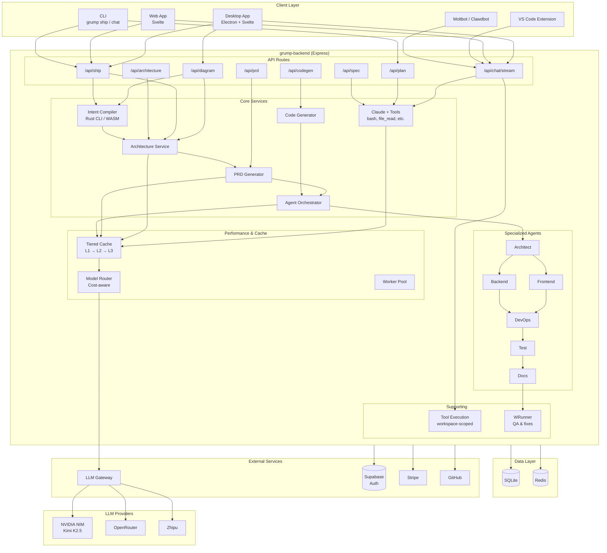

# G-Rump Unified Architecture

A single, connected view of the complete system—from user actions through backend services to external providers and back.

---

## Complete System Diagram



---

## End-to-End Flows

### 1. Design Mode (Diagram)

```
User types "login flow" in Chat
  → /api/generate-diagram-stream
  → Intent Compiler (extracts actors, features)
  → LLM (via Cache → Router → NIM/OpenRouter)
  → Mermaid diagram streamed back
  → DiagramRenderer displays
```

### 2. Code Mode (Tool-Enabled Chat)

```
User types "create a button" in Code mode
  → /api/chat/stream
  → Claude + Tools (file_write, bash, etc.)
  → Tool Execution (workspace-scoped)
  → LLM responds with tool calls
  → Tools run, results streamed back
  → ChatInterface updates
```

### 3. Ship Flow (Architecture → PRD → Code)

```
User triggers SHIP
  → /api/ship
  → Intent Compiler → Architecture Service (C4 diagrams)
  → PRD Generator (requirements doc)
  → Agent Orchestrator (Architect → Frontend → Backend → DevOps → Test → Docs)
  → WRunner (QA & auto-fixes)
  → ZIP download / GitHub push
```

### 4. Caching Path

```
Any LLM request
  → Tiered Cache check (L1 memory → L2 Redis → L3 disk)
  → Hit: return cached response
  → Miss: Model Router picks provider (cost-aware)
  → NIM / OpenRouter / Zhipu
  → Response cached for next time
```

---

## Component Legend

| Layer | Components |
|-------|------------|
| **Clients** | Desktop (Electron+Svelte), Web (Svelte), VS Code, CLI, Moltbot |
| **Backend** | Express API, routes, services, agents |
| **Data** | SQLite (primary), Redis (optional cache/rate-limit) |
| **External** | Supabase (auth), Stripe (billing), GitHub (repos) |
| **LLM** | NVIDIA NIM, OpenRouter, Zhipu (routed by cost/availability) |

---

## Related Docs

- [ARCHITECTURE.md](./ARCHITECTURE.md) – Component details, stores, routes
- [API.md](./API.md) – Full API reference
- [PERFORMANCE_GUIDE.md](./PERFORMANCE_GUIDE.md) – Cache, workers, optimization
